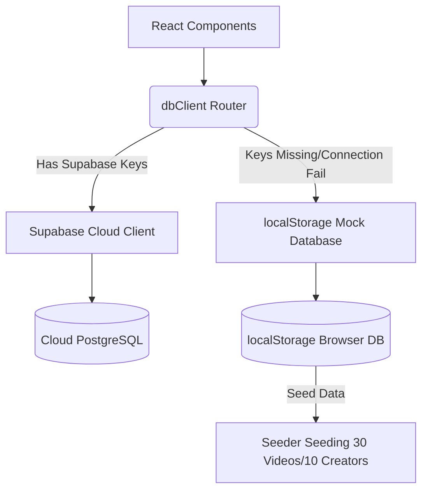

# System Architecture - OpenDrama MVP

## 1. Directory Structure

OpenDrama is organized as an extensible codebase separation:
- `apps/web/`: React frontend, compiling utilizing Vite, styled using Tailwind CSS v4.
- `supabase/`: Holds PostgreSQL migrations and Deno Edge Function scripts.
- `docs/`: Guides covering system specifications.

## 2. Hybrid Database Client Pattern

To maintain out-of-the-box preview capabilities without requiring local Docker-Supabase running, the frontend query layers route calls through `dbClient.ts`:

## 3. Server-Side Deno Edge Functions
Edge Functions are located in `supabase/functions/` and are built for Deno:
- `/upload`: Coordinates file uploading streams.
- `/video/analyze`: Contacts Gemini models server-side for metadata extraction.
- `/recommendation-feed`: Computes personalized score lists utilizing pgvector.

## 4. Performance & Responsive Controls
- **Gestures snap:** Utilizes Tailwind `snap-y-mandatory` scroll-snapping for vertical player scrolling, avoiding heavy JavaScript touch trackers.
- **Intersection Autoplay:** Uses standard React `IntersectionObserver` bindings to selectively play the vertical video in viewport, conserving bandwidth.
- **State Management:** Employs React context models (`useAuth`) to make user details available across all tabs.
